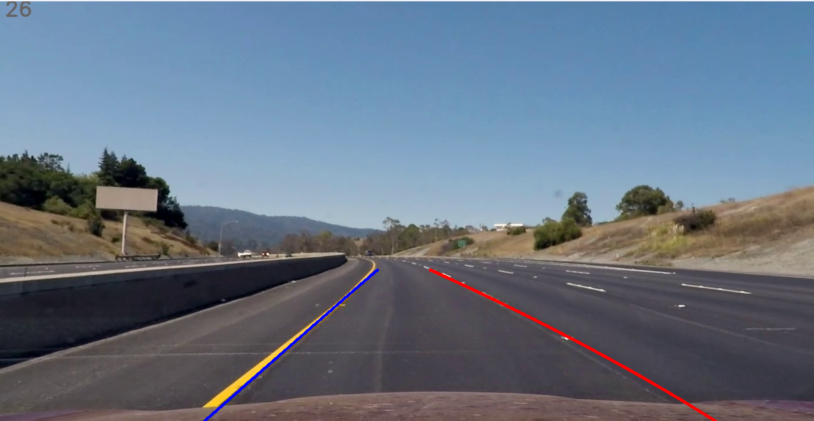
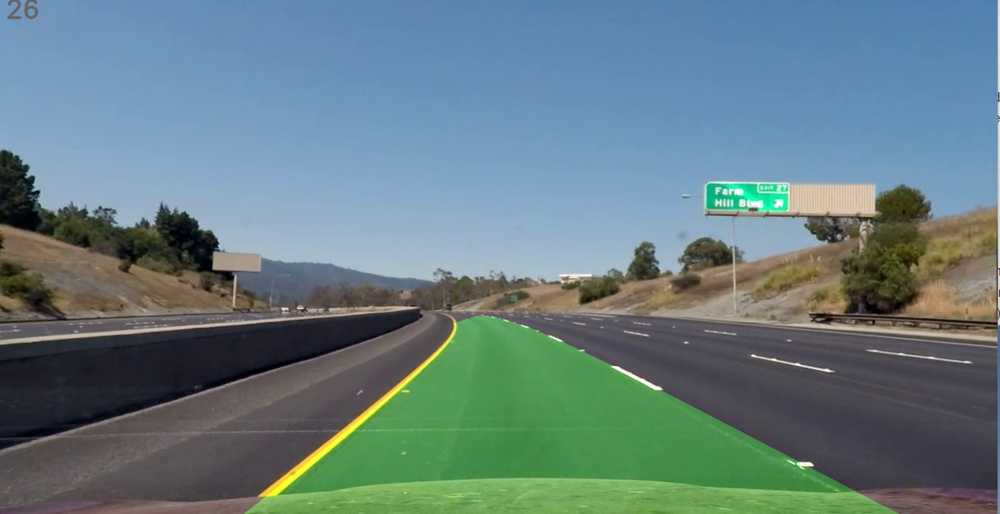
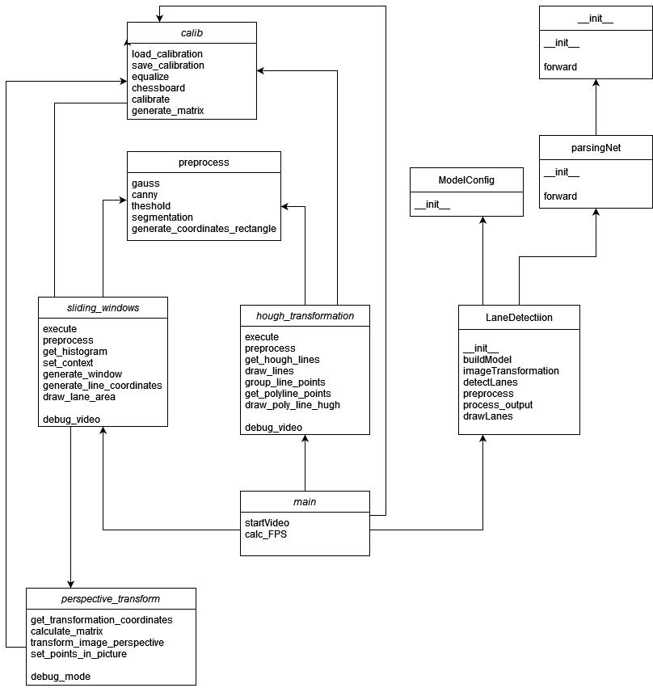
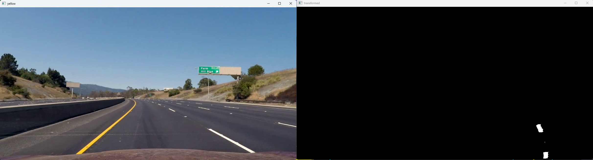
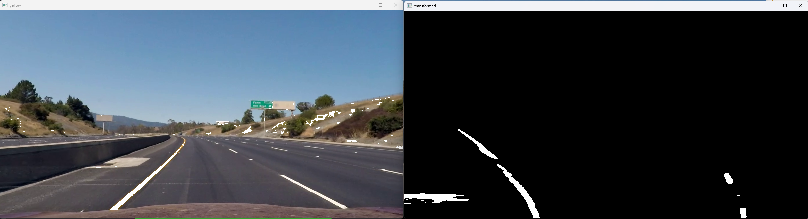
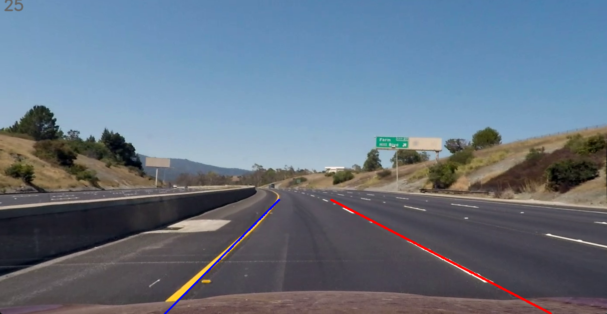
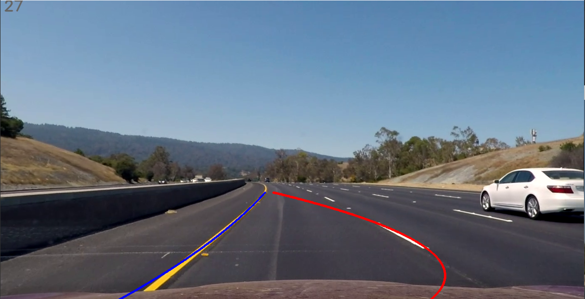
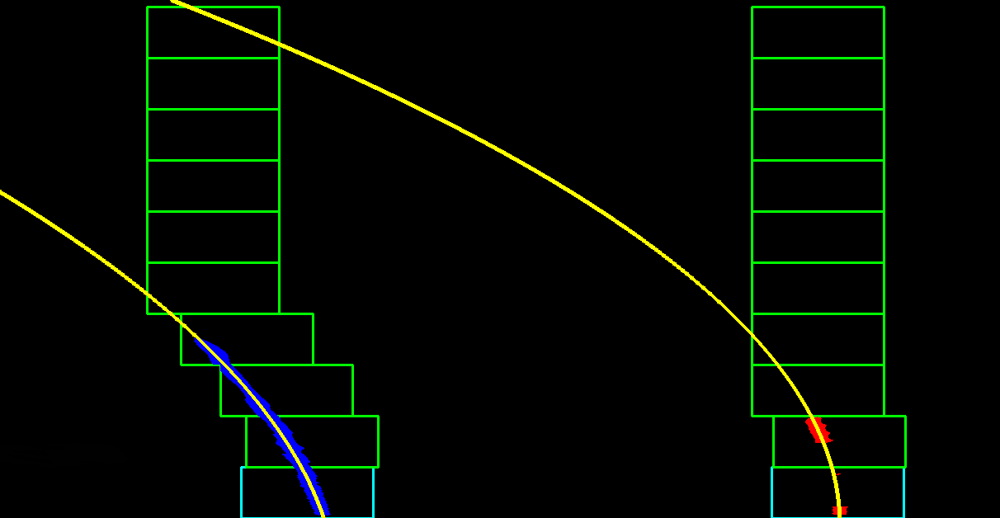
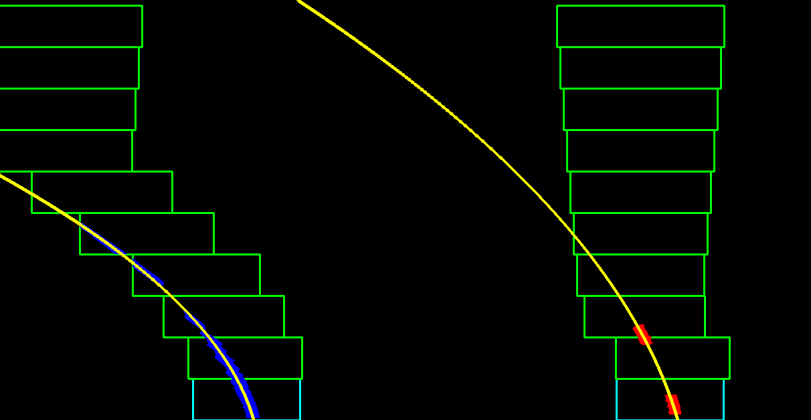

# Spurerkennung

Dieses Projekt beinhaltet die Prüfungsleistung für den Kurs Digitale Bildverarbeitung an der Dualen Hochschule Bade-Württemberg. Aufgabe ist es, eine Spurerkennung für ein Video zu erstellen. Bonusaufgaben können zudem ergänzt werden. Für genauere Anforderungen, siehe [Task.pdf](Task.pdf).

**Hinweis: Die Videos für die Abgabe sind unter `Documentation/Videos` zu finden!**

**Hinweise zum KI-Modell: Der direkte Download ist: <https://drive.google.com/file/d/1WCYyur5ZaWczH15ecmeDowrW30xcLrCn/view?usp=sharing> Der Pfad des Models muss dann in der mein als model_path mitgegeben werden**

## Ordnerstruktur

```Text
|- config: Konfiguration für jedes Video
|- Documentation: Dokumentation des Projekts
    |- Images: Bilder für die Dokumentation
    |- Videos: Videos der endgültigen Version
|- img: Bilder und Videos für das Projekt
|- src: Performante Python Implementierung
    |- model: KI-Modell
calibration.calib: Kamera Kalibrierung
Task.pdf: Aufgabenstellung
```

## Gewählte Vorgehensweise

Das Ziel ist, verschiedene Ansätze für die Spurerkennung zu entwickeln und sie zu vergleichen. Dazu gehört, dass das Bild zuerst entzerrt und gegebenenfalls in Vogelperspektive transformiert wird. Darauf aufbauend folgenden verschiedene Ansätze:

1. Hough Transformation
2. Sliding Windows
3. KI-Modell

Der Gedanke hinter dieser gewählten Reihenfolge war, zuerst mit etwas simplerem anzufangen. Zudem wurde die Hough Transformation in der Vorlesung schon behandelt und bot somit einen guten Einstieg. Durch eine Internet-Recherche wurde das Modell der Sliding Windows entdeckt. Obwohl es zunächst prototypisch implementiert war, funktionierte es sehr gut und hat den Hough Ansatz in seiner Genauigkeit bei Weitem übertroffen (siehe Bilder: Hough oben, Sliding Windows unten).



Wie in den beiden Bildern zu sehen, findet der Sliding Window Ansatz die Spur deutlich korrekter und kann weiter in die Ferne schauen. Deswegen wurde sich dafür entschlossen, den Ansatz vollständig zu implementieren und als Erweiterung zu verwenden.

Im Allgemeinen wurde das Entzerren, die Vogelperspektive, die Hough Transformation und der Sliding Window Ansatz zuerst prototypisch in [Prototyping.ipynb](Documentation/Prototyping.ipynb) implementiert. Aufgrund von Unübersichtlichkeit und Performance Einbusen im Jupyter Notebook wurde sich entschieden, die Prototypen in Python nativ zu implementieren. Ab diesem Punkt wurden die Prototypen nicht weiter im Notebook entwickelt. Um die Spurerkennung einfacher für die Videos konfigurieren zu können, wurde danach eine Architektur für die Konfiguration und den Ablauf des Programms entwickelt:



Es wurde sich explizit dafür entschieden, dass es eine Main-Klasse und für jeden Ansatz eine eigene Klasse gibt. Die Main-Klasse ist dabei für das Starten des Videos und Aufrufen der Unterklassen zuständig. Die einzelnen Ansätze funktionieren unabhängig voneinander und benutzten Hilfsklassen, um gemeinsame Funktionen auszuführen. Außerdem gibt es für die Transformation und die Kamerakalibrierung jeweils eine eigene Klasse.

Als vorletztes wurde die Spurerkennung auf das Challenge Video ausgeweitet und konfiguriert, um eine Generalisierbarkeit der Spurerkennung zu testen. Das Ergebnis ist, dass beide Ansätze (Hough und Sliding Window) auf dem [Projekt](img/Udacity/project_video.mp4) und [Challenge Video](img/Udacity/challenge_video.mp4) mit über 20 FPS funktionieren. Dabei erkennen beide Ansätze auf dem Projekt Video nahezu perfekt die Fahrbahnmarkierungen. Beim Challenge Video schneiden beide Ansätze ein wenig schlechter ab. Es gibt öfters Ausreißer und unter der Brücke wird die Spur kurz vollständig verloren. Auffällig ist dabei, dass Sliding Windows hier konstanter funktioniert, sowohl die Erkennung als auch die Performance. Dies liegt an der Vogelperspektive und der verbesserten Spurverfolgung (siehe [Zusatzfunktionen für Bonusaufgaben](README.md#zusatzfunktionen-für-bonusaufgaben)). Beide Ansätze erkennen mehr als 90% der Fahrbahnmarkierungen.

Um einen weiteren Ansatz zu verwenden, der möglicherweise noch bessere Genauigkeit und Stabilität leistet, sollte ein KI-Ansatz entwickelt werden. Hierfür war die erste Idee selbständig ein RestNet zu erstellen und mit selbst gelabelten Daten zu trainieren. Nach anfänglichen startproblemen und vor allem fehlender Menge an Daten wurde sich für ein vor trainiertes KI Modell entschieden. Dieses sollte jedoch auch auf einem RestNet basieren, da dafür bereits Infrastruktur in unserem Projekt bestand. Auf der Suche nach einem vor trainierten Modell sind wir auf wissenschaftliche Arbeiten der CUILane und TuiSimple Challenge gestoßen. Nach erstem Testen und Modifizieren, wurde sich für ein Modell des TuiSimple Datensatzes entschieden. Dieser erzielte eine hohe Stabilität auf unseren Daten. Nach weiteren Modifizierungen der Input und Output Verarbeitung wurden sehr gute Ergebnisse erzielt. Weitere Schritte in der Optimierung wäre ein weiteres Training der KI mittels neuer selbst gelabelter Daten.

## Zusatzfunktionen für Bonusaufgaben

Um die Spurerkennung auf möglichst vielen Videos performant zu implementieren, wurden verschiedene Verbesserungen und Optimierungen durchgeführt. Im folgenden werden sie genauer erläutert:

1. Verbesserung von Hough-Transformation: Neuer Ansatz Sliding Windows
2. Vorverarbeitung: Gelbe Linie auf Weiss Mappen
3. Hough-Transformation: Verwenden eines Polynom 2. Grades mit Fixpunkten
4. Sliding Windows: Spurverfolgung und Box Vergrößerung

### 1. Verbesserung von Hough-Transformation: Neuer Ansatz Sliding Windows

Die Hough-Transformation erkennt die Fahrspur nicht immer genau. Das liegt daran, dass sie auf dem nicht transformierten Bild arbeitet. Deswegen findet sie weiter entfernte Punkte ziemlich schwer. Um dem entgegen zu wirken, wurde nach einem weiteren Ansatz gesucht. Nach einer Internet Recherche wurde sich für Sliding Windows entschieden, weil er relativ simpel und trotzdem im Verhältnis sehr performant funktioniert. Sliding Windows basiert auf der Vogelperspektive und kleineren Suchfenstern (genaue Dokumentation siehe [Sliding_Windows.ipynb](Documentation/Sliding_Windows.ipynb)). Dadurch werden Ausreißer nicht betrachtet. Das Ergebnis ist, dass der Sliding Windows Ansatz die Spur präziser und auch in größerer Entfernung zuverlässiger finden kann als die Hough-Transformation (siehe Bilder: Hough oben, Sliding Windows unten):


### 2. Vorverarbeitung: Gelbe Linie auf Weiss Mappen

Wendet man die normalen Ansätze oder Vorverarbeitungen (wie Canny-Edge oder Threshold) an, dann wird die Kante der gelben Linie nicht immer erkannt. Dies liegt daran, dass der Helligkeitswert von der gelben Farbe nicht so hoch ist wie die Helligkeit der weißen Spur. Wenn man den Threshold also so einstellt, dass er auch die gelbe Linie erkennt, dann werden deutlich mehr Ausreißer und ungewollte Punkte erkannt. Dies ist für beide Algorithmen nachteilhaft. Als Verbesserung wurde sich deshalb überlegt, die gelbe Line im Project und Challenge Video auf Weiss zu Mappen. Somit kann der Threshold-Wert deutlich höher gewählt werden. Als Resultat werden viel weniger Störpunkte erkannt, die Algorithmen können also besser und präziser arbeiten. Vor allem auf dem Projektvideo im Bereich des Betons ist dies gut zu erkennen. Nachteile dieser Verbesserung sind dafür eine geringere Verarbeitungsgeschwindigkeit und schlechtere Generalisierbarkeit.

**Mit Gelb:**


**Ohne Gelb, dafür Weiß:**


### 3. Hough-Transformation: Verwenden eines Polynom 2. Grades mit Fixpunkten

Bei der Recherche zum Hough-Ansatz wurden meistens gerade Linien verwendet, die auf dem Mittelwert der erkannten Linienpunkte liegen. Dies hat aber das Problem, dass keine Krümmungen erkannt werden können und die Spur deshalb nicht genau modelliert werden kann. Das folgende Bild zeigt, dass die Linien keiner Krümmung folgen und nicht den richtigen Spurbereich wiederspiegeln.


Als Verbesserung wurde sich zunächst überlegt, ein Polynom höheren Grades auf die Mittelpunkte der erkannten Linien zu legen. Dadurch können Krümmungen und Kurven erkannt werden. Dafür ergab sich ein neues Problem: Die Polynome entsprechen nicht mehr der Spur und berühren sie nur in wenigen Punkten (nächstes Bild). Das liegt daran, dass die Hough-Transformation nicht zuverlässig alle Linien in kurzer oder weiterer Entfernung finden kann. Sie kann nur entweder auf die Ferne oder auf Nähe eingestellt werden. Außerdem werden bei der rechten Spur immer nur einzelne Abschnitte erkannt, weil die Spur nicht durchgezogen ist.


Wie man im Bild sieht, fehlen vor allem die näheren und weiter entfernten Punkte. Dieses Problem wurde dann umgangen, indem Fixpunkte für jedes Video erstellt wurden. Diese Fixpunkte werden zur Berechnung des Polynoms verwendet, wenn der unterste erkannte Punkt eine bestimmte Höhe nicht unterschreitet. Die Fixpunkte befinden sich deswegen im unteren Bereich des Bilds und sollen den vermuteten Verlauf der Linie darstellen. Dadurch wird das Polynom in gewisser Weise gerade gezogen (siehe nächstes Bild).


Dadurch können jetzt Krümmungen und Kurven erkannt werden und somit der Verlauf der Spur deutlich verbessert werden. Einziges Problem des Ansatzes ist die Generalisierbarkeit, weil die Spur sich nicht immer im gleichen Bereich eines Fixpunktes befinden muss. Hierfür könnten sich ehemalige Punkte gemerkt und als Fixpunkte eingespielt werden.

### 4. Sliding Windows: Spurverfolgung und Box Vergrößerung

Bei der Sliding Windows Implementierung ist aufgefallen, dass es ineffizient ist bei jedem Frame erneut das gesamte Bild auf die Spur zu durchsuchen. Deswegen wurde versucht, bereits erkannte Spuren weiter zu verfolgen. Dadurch muss nur noch ein kleiner Teilbereich des Bildes durchsucht werden und nicht das gesamte Bild. Umgesetzt wurde diese Spurverfolgung wie folgt: Bei jeder erfolgreichen Spurerkennung wurde die Position des zweiten Fensters gespeichert. Diese Position kann im nächsten Frame als Ausgangspunkt für die Suche dienen. Man kann somit abschätzen wo sich die Spur befinden muss. Im nächsten Frame kann also im unmittelbaren Umfeld der gespeicherten Position nach der Spur gesucht werden. Das beschleunigt das Suchen der Spur zu Beginn eines neuen Frames.

In der produktiven Verwendung konnte in den FPS keine echte Verbesserung der Leistung mit diesem Ansatz festgestellt werden, allerdings wurde die Genauigkeit dadurch ein wenig verbessert. Es kommt seltener vor, das Störsignale als Spurstart interpretiert werden.

Außerdem haben Sliding Windows das Problem, dass sie bei starken Krümmungen nicht so weit ind die Ferne blicken können. Das liegt daran, dass Kurven mit starker Krümmung das Polynom so stark abknickt, dass das nächste Window sie nicht mehr erreichen kann. Dadurch konnte in Kurven nur eine verringerte Distanz erkannt werden. Um diesen Effekt zu kompensieren wurde damit begonnen, die Windows größer zu machen. Das verbessert die Sichtweite und Genauigkeit in stark gekrümmten Kurven. Dieser Ansatz hat keine Nachteile, weil Pixel weiter oben im Bild einer größeren Distanz entsprechen als weiter unten im Bild. Größere Fenster im oberen Bildbereich führen somit zu keiner Massgeblichen Verschlechterung in größerer Entfernung.

Um zusätzliche störsignale im Fahrzeug nahen Bereich zu meiden, können die Windows unten schmaler gewählt werden und mit zunehmender Distanz linear größer werden. Damit kann der Kurvenverlauf in größeren Distanzen besser erkannt werden und weniger Störsignale im nahen Bereich verarbeitet werden.

**Vor der Verbesserung:**


**Nach der Verbesserung:**


Es ist zu sehen, dass die linke Spur deutlich länger von den Sliding Windows erkannt wird und dadurch die Krümmung präziser ist.

## Lessons Learned

In diesem Projekt konnten wir einiges für zukünftige Projekte mitnehmen:

- Bildverarbeitung ist schon mit wenig Erfahrung sehr mächtig (und macht auch noch Spass!:)).
- Der 1. Ansatz ist nicht immer der Beste, kann aber gut optimiert werden.
- Mehrere Ansätze führen zum Ziel.
- Architektur ist in einem IT-Projekt sehr wichtig und führt zu einer Modularisierung. Dadurch können neue Ansätze ziemlich schnell eingebunden werden.
- Ein klassischer Ansatz kann einen KI-Ansatz übertreffen. Vor allem, wenn es nicht genug Trainingsdaten gibt.
- Konfiguration und Generalisierung sind sehr wichtig in IT-Projekten. Ein Framework zum Erstellen dieser Konfigurationsdaten kann dabei Zeit sparen.
- Labeln von KI-Modellen ist sehr zeitintensiv und muss gewissenhaft durchgeführt werden.

## Diskussion der Ergebnisse / Fazit und Ausblick

Das Ergebnis der Projektarbeit sind zwei verschiedene Ansätze, welche auf den Videos Projekt und Challenge sehr gut und ziemlich gut funktionieren. Zusätzlich konnte noch ein vollständig funktionierender KI-Ansatz erfolgreich implementiert werden. Bei diesem muss allerdings kritisch reflektiert werden, dass er in der Distanz nicht so gut funktioniert wie die beiden anderen. Auf den Fahrzeug nahen Bereich fällt der Unterschied allerdings deutlich geringer aus. Durch umfangreiche Optimierung von sowohl bereits umgesetzten Ideen, als auch durch das Einbinden neuer Ansätze konnte die Spurerkennung kontinuierlich verbessert werden. Das Resultat sind verschiedene Vorgehensweisen, welche alle ihre eigenen Anwendungsgebiete haben. Die Sliding Windows haben eine hohe Genauigkeit, Hough-Transformation kann eine hohe Verarbeitungsgeschwindigkeit bieten und die KI könnte, mit mehr Trainingsdaten und besserer Optimierung auf diese, der generellste und dadurch auch realistischste Ansatz sein. All dies wird in der technischen Dokumentation noch genauer erklärt (siehe Dateien in ```Documentation/```).

Als kritischer Ausblick kann gesagt werden, dass durch mehr Optimierung oder durch das Wählen komplexerer Ansätze eine bessere Spurerkennung erstellt werden kann. Es wäre außerdem noch wünschenswert, einen gesamten Ansatz zu verwenden. Alternativ kann auch ein Algorithmus entwickelt werden, welcher entscheidet, welcher Ansatz die plausibelsten Lösungen liefert. Dieser könnte dann während einer Fahrt dynamisch den Ansatz wechseln und dadurch die Erkennung auch verbessern durch das Kombinieren der bisherigen Ansätze. Ein weiter Punkt ist die Spezifikation auf die beiden Videos. Die Ansätze sind nicht flexibel, sie müssen für jede Situation einzeln konfiguriert werden. Die Generalisierbarkeit von Sliding Windows und Hough ist also nicht gegeben, bei der KI ist dies dagegen deutlich besser.

Das Fazit des Projektes ist ein erfolgreiches implementieren von tendenziell simplere Ansätzen. Dies kann als eine gute Grundlage für tiefer gehende Forschung im Bereich der Fahrspurerkennung verwendet werden und bereitet einen Einstieg in die Welt der digitalen Bildverarbeitung.

## Ausblick

In diesem Projekt konnten einige Punkte aufgrund von mangelnder Erfahrung und Zeit nicht umgesetzt werden.

- KI-Modell selber trainieren und mehr Trainingsdaten sammeln bzw. labeln.
- Automatische Helligkeits- und Kontrastanpassungen um auch bei wechselnden Lichtverhältnissen die Spur erkennen zu können.
- Berechnen der Geschwindigkeit des Fahrzeugs.
- Einbau eines Kanban-Filters, der die Position der Spur aus vorherigen Frame mit einbezieht und dadurch eine hohe Genauigkeit erzielen kann.

## Quellen und Code-Snippets

Diese Referenzen wurden als Inspiration für die dargestellten Lösungen verwendet. Teilweise wurden einzelne Code snippets verwendet.

- <https://medium.com/@mrhwick/simple-lane-detection-with-opencv-bfeb6ae54ec0> (Segmentation and Hugh Transformation)
- <https://towardsdatascience.com/a-deep-dive-into-lane-detection-with-hough-transform-8f90fdd1322f> (Segmentation and Hugh Transformation)
- <https://github.com/AndrikSeeger/Lane_Detection> (Alleskönner)
- <https://docs.opencv.org/4.x/da/d54/group__imgproc__transform.html> (Image perspective transformation)
- <https://medium.com/analytics-vidhya/opencv-perspective-transformation-9edffefb2143> (Image perspective transformation)
- <https://github.com/tatsuyah/Lane-Lines-Detection-Python-OpenCV> (Sliding Windows generation and calculation)
- <https://kushalbkusram.medium.com/advanced-lane-detection-fd39572cfe91> (Sliding Window understand how they work)
- [https://github.com/cfzd/Ultra-Fast-Lane-Detection-v2]("https://github.com/cfzd/Ultra-Fast-Lane-Detection-v2") (Vortrainierte Modell)
